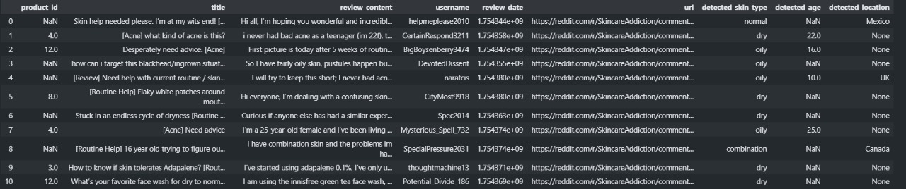

# Reddit Skincare Review Extractor 🧴

This project extracts skincare product reviews from Reddit using the PRAW API. It focuses on pulling data from subreddits like `r/SkincareAddiction` and structures the data for analysis.

## 🔍 Features

- Fetch posts from subreddit
- Extract metadata: title, body, author, score, comment count
- Output to structured format using pandas

## 🚀 How to Run

1. Clone this repo
2. Install dependencies:

```bash
pip install -r requirements.txt
```

3. Add your Reddit credentials in the notebook
4. Run the notebook: `reddit_scraper.ipynb`


## 📌 Subreddit Example
- r/SkincareAddiction

## 📊 Sample Output (Final Structured Data)



✨ The table includes: `product_id`, `title`, `review_content`, `username`, `review_date`, `detected_skin_type`, `detected_age`, and `detected_location` — extracted from Reddit posts and enriched using simple logic.
